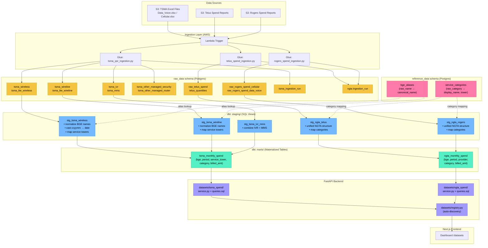

# Data Pipeline Architecture

## Layer Summary

| Layer | Schema / Location | Materialization | Purpose |
|-------|------------------|-----------------|---------|
| **Raw** | `raw_data.*` | Tables | Historical archive, as-received from provider |
| **Staging** | `dbt: staging/` | Views | Normalize, cast, alias — no aggregation |
| **Reference** | `reference_data.*` | Tables (migrations) | Lookup data (BGE aliases, category maps) — editable without deploy |
| **Marts (Clean)** | `dbt: marts/` | Tables | Reporting-ready, aggregated by BGE/period/category |
| **Dataset plugins** | `app/backend/app/datasets/` | — | FastAPI layer over marts |

## Key Decoupling Principle

Ingestion scripts (Glue jobs) write only to `raw_data` — they have no knowledge of reporting structure.
dbt models read only from `raw_data` sources — they have no knowledge of how data arrived.
